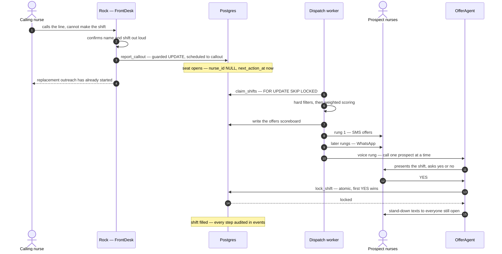
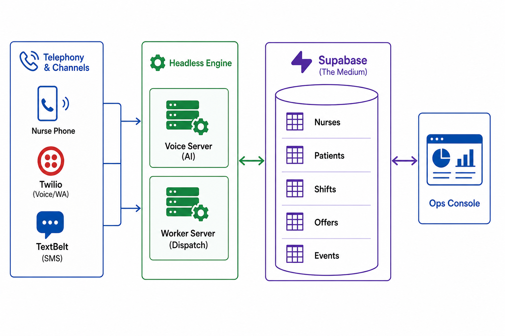
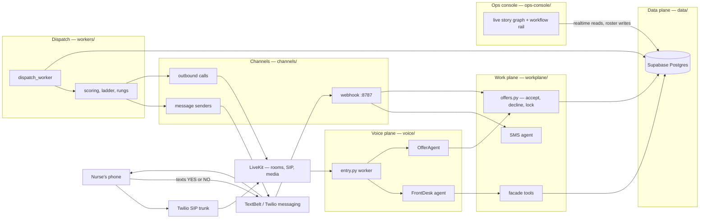
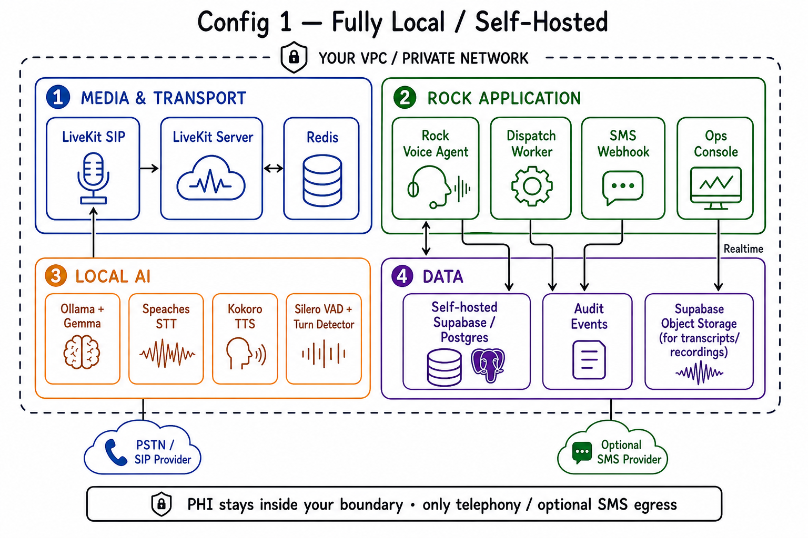
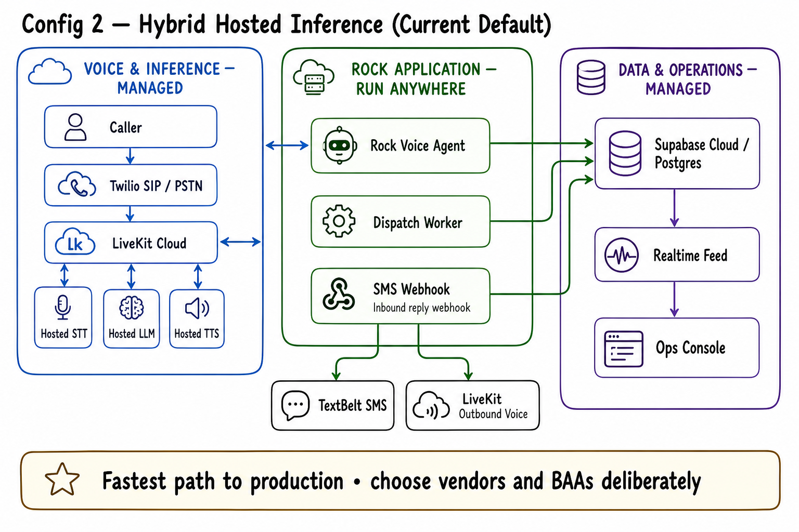
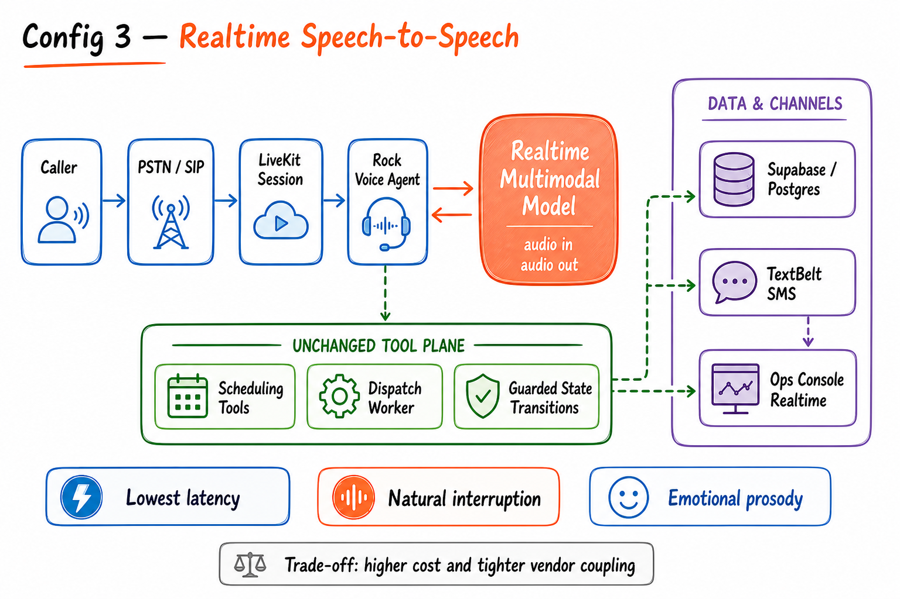

# Rock Scheduler

Voice-AI shift backfill for home health care. A nurse calls out; Rock covers the shift.

Rock Scheduler is an open-source platform built on [LiveKit Agents](https://docs.livekit.io/agents/) (Python), Supabase Postgres, Twilio SIP, TextBelt SMS, and a React ops console. A nurse dials the agency line — the demo agency is the fictional **Rockram Home Health Care** on **+1 929 730-7867** — and tells Rock, the AI front desk, that she cannot make her shift. From that sentence on, the machine runs itself:

1. Rock confirms the shift out loud and records the callout with one guarded database update.
2. A dispatch worker claims the open seat, filters and scores every eligible replacement, and writes a scoreboard.
3. The worker climbs an outreach ladder: SMS, then WhatsApp, then live AI voice calls, one prospect at a time.
4. The first YES wins an atomic lock. Double-booking is impossible at the storage layer, not merely checked in code.
5. Everyone else still waiting gets a courteous stand-down text. Every step lands in an append-only audit log.

Phoned in at minute zero, covered by minute three. That is the story the whole system is shaped around.

**The UI is a window. The engine is headless.** The ops console never calls the engine, and the engine never calls the console. The console only reads realtime rows from Postgres and registers rosters; close it mid-callout and nothing changes. Any UI — or no UI — works, because the state machine lives in the database.

## The three-minute story



A YES can arrive on any channel — an SMS reply hits the same `accept_offer` implementation the voice tool uses, so the lock, the guarded state change, and the stand-downs can never drift apart.

## System architecture





Tools are the only boundary crossing between conversation and work: the voice plane never knows Supabase exists, and the work plane never knows which voice engine is speaking.

## Three ways to run it

`voice/session_factory.py` is the only module that knows engine names. `ENGINE_PROFILE` in `.env` picks one adapter; the agents, tools, worker, ladder, and database are byte-for-byte identical across all three. These topologies are configuration, not forks. The deep version — component tables, env matrix, a reference docker-compose blueprint, capacity planning — is in [docs/deployment.md](docs/deployment.md).

### Config 1 — Fully self-hosted, dockerized

Everything runs inside your boundary: self-hosted LiveKit server and SIP gateway (both open source), self-hosted Supabase or plain Postgres, Ollama serving a Gemma-class model (e4b or 12b), faster-whisper STT via speaches, Kokoro TTS, plus the Rock worker, voice worker, webhook, and console as containers. The only traffic crossing the boundary is SIP signaling and PSTN audio to your telco trunk.



Honest status: this maps to `ENGINE_PROFILE=gemma_phi`, which today is a wired profile seam that fails loudly (`voice/engines/gemma_phi.py` raises `NotImplementedError`). The local model integration is on the roadmap; the topology is documented now because everything else in the stack already deploys this way.

### Config 2 — Hybrid hosted inference (the current default)

`ENGINE_PROFILE=cascade`: LiveKit Cloud carries rooms and SIP; STT, LLM, and TTS are hosted vendors — Deepgram nova-3, OpenAI gpt-4.1-mini, Cartesia sonic-3 — reached directly with vendor keys or routed through LiveKit Inference when the keys are empty. Supabase cloud holds the data plane; Twilio provides the SIP trunk. The app and worker run anywhere — a laptop is enough. Every vendor in this lane offers a BAA on its business or enterprise tier; signing them is on you.



### Config 3 — Realtime speech-to-speech

`ENGINE_PROFILE=realtime`: one multimodal model (OpenAI Realtime) does audio-in and audio-out in a shared latent space. No STT, no TTS, no separate turn detector — the model owns voice activity and turn-taking. Lowest latency and the most natural, emotional prosody of the three. The trade-off is cost and vendor coupling. The tools and the entire work plane are unchanged — that is the point of the engine-agnostic agent design.



## Quickstart

Requires Python 3.11+ and Node 20+.

```bash
git clone <this-repo> && cd Rock-scheduler-voice-agent
python3 -m venv .venv && source .venv/bin/activate
pip install -r requirements.txt
cp .env.example .env   # fill in keys, see below
```

The keys that matter first (`shared/config.py` is the single module that reads the environment; full matrix in [docs/deployment.md](docs/deployment.md)):

| Key | What it is for |
| --- | --- |
| `LIVEKIT_URL`, `LIVEKIT_API_KEY`, `LIVEKIT_API_SECRET` | LiveKit project — rooms, SIP, and Inference fallback models |
| `OPENAI_API_KEY` | realtime engine, cascade LLM, and the Pydantic AI work plane |
| `SUPABASE_URL`, `SUPABASE_SERVICE_ROLE_KEY` | data plane — the app writes with the service role |
| `ENGINE_PROFILE` | `cascade` (default), `realtime`, or `gemma_phi` (stub) |
| `DEEPGRAM_API_KEY`, `CARTESIA_API_KEY` | optional — empty routes the same models through LiveKit Inference |
| `AGENT_NAME` | must match the SIP dispatch rule for inbound phone calls; empty = playground auto-dispatch |
| `TWILIO_ACCOUNT_SID`, `TWILIO_AUTH_TOKEN`, `TWILIO_PHONE_NUMBER` | telephony + WhatsApp sender |
| `LIVEKIT_SIP_OUTBOUND_TRUNK_ID` | outbound offer calls (`channels.cli status` lists trunks) |
| `TEXTBELT_KEY` | SMS sender — the free `textbelt` key is capped at 1 message/day |
| `PUBLIC_BASE_URL` | your ngrok https URL, so SMS replies reach the webhook |

Apply the schema and seed a demo world (fake 555 numbers, never dialed):

```bash
psql "$DB_URL" -f data/schema.sql          # once
psql "$DB_URL" -f data/dashboard.sql       # once — console policies, realtime, RPCs
python -m data.seed                        # agency + 10 nurses + 2 demo shifts
python -m data.seed --me +1XXXXXXXXXX      # optional: outreach reaches YOUR phone
```

Run the stack (four terminals):

```bash
python -m workers.dispatch_worker          # 1. the scheduler
python -m voice.entry dev                  # 2. FrontDesk + OfferAgent voice worker
python -m channels.cli serve               # 3. SMS webhook on :8787
cd ops-console && npm install && npm run dev   # 4. console on http://localhost:8080
```

No telephony yet? `python -m voice.entry console` talks through your terminal mic (use headphones; add `--text` to type). With SIP configured, call the line and say "This is Maria — I can't make my shift." Then watch the console.

Channel notes:

- **US SMS ships through TextBelt**, not Twilio: unregistered US numbers are A2P-blocked by carriers (Twilio error 30034, roughly 2 weeks of registration review). TextBelt needs a paid key for US delivery and for reply webhooks.
- **WhatsApp** rides Twilio's sandbox: join once by texting the console's `join <code>` to +1 415 523 8886, and paste `PUBLIC_BASE_URL/sms` into the sandbox inbound-message box.
- **SMS replies** need a tunnel: `ngrok http 8787`, put the https URL in `PUBLIC_BASE_URL`, and (for Twilio inbound) run `python -m channels.cli link-sms` once. Signatures are validated on both webhook routes.
- **Sanity check** everything with `python -m channels.cli status`; provision SIP for a fresh number with `... provision`.

## Design decisions

The full reasoning lives in [docs/decisions.md](docs/decisions.md). The headlines:

- **The shifts table is the queue.** No broker: workers poll a partial index and claim rows with `FOR UPDATE SKIP LOCKED`. Waits are row timestamps, never sleeping workers, so any worker resumes any shift after any crash.
- **Safety lives in the database.** An exclusion constraint makes double-booking impossible; `lock_shift` makes first-YES-wins atomic; a trigger audits every status change.
- **Every state transition is a guarded UPDATE** carrying the expected previous state, so races lose cleanly instead of corrupting.
- **Rungs bump before sending.** Crash-resume can never double-text a nurse; `UNIQUE(shift_id, nurse_id)` means rescoring can never double-offer.
- **Lead time picks the ladder** — relaxed, normal, or urgent — and quiet hours (22:00–06:00 agency-local) gate voice calls.
- **Callers are resolved by phone number, identified by name.** One real phone may back several nurse rows — deliberate, for solo demos.
- **The OfferAgent is scope-locked.** An outbound callee is untrusted audio; its only tools accept or decline that single offer.

## Repository layout

```
Rock-scheduler-voice-agent/
├── voice/                  # conversation plane: LiveKit worker + engines + agents
│   ├── entry.py            # worker entrypoint; dispatch metadata picks the agent
│   ├── session_factory.py  # ENGINE_PROFILE seam: cascade | realtime | gemma_phi
│   ├── engines/            # one adapter per profile (gemma_phi is a stub)
│   └── agents/             # FrontDesk (inbound), OfferAgent (outbound, scope-locked)
├── workplane/              # brains behind the tools: Pydantic AI + plain functions
│   ├── tools/              # facade tools: find_nurse, get_shift, report_callout
│   ├── agents/             # matching_agent (spoken ranking), sms_agent (inbound texts)
│   └── offers.py           # accept/decline + lock + stand-downs, the ONE implementation
├── workers/                # dispatch_worker loop, ladder policy, scoring, rung execution
├── channels/               # transport: SIP plumbing, outbound calls, SMS/WhatsApp, webhook, CLI
├── data/                   # schema.sql, dashboard.sql, db.py (all Postgres access), seed.py
├── shared/                 # config.py (the only env reader), phone.py, spoken.py
├── ops-console/            # React ops console: live story graph + workflow rail
├── dashboard/              # earlier react-flow prototype, superseded by ops-console
└── docs/                   # the deep documentation, linked below
```

## Documentation

| Doc | What is inside |
| --- | --- |
| [docs/architecture.md](docs/architecture.md) | component-by-component walkthrough, ER diagram, shift and offer state machines |
| [docs/deployment.md](docs/deployment.md) | the three configs in depth: component tables, env matrix, a reference docker-compose blueprint, capacity planning |
| [docs/decisions.md](docs/decisions.md) | why Postgres, why so few tables, the discipline rules, ladder, identity, channels, scoring |
| [docs/demo.md](docs/demo.md) | the solo one-phone demo playbook, start to finish |
