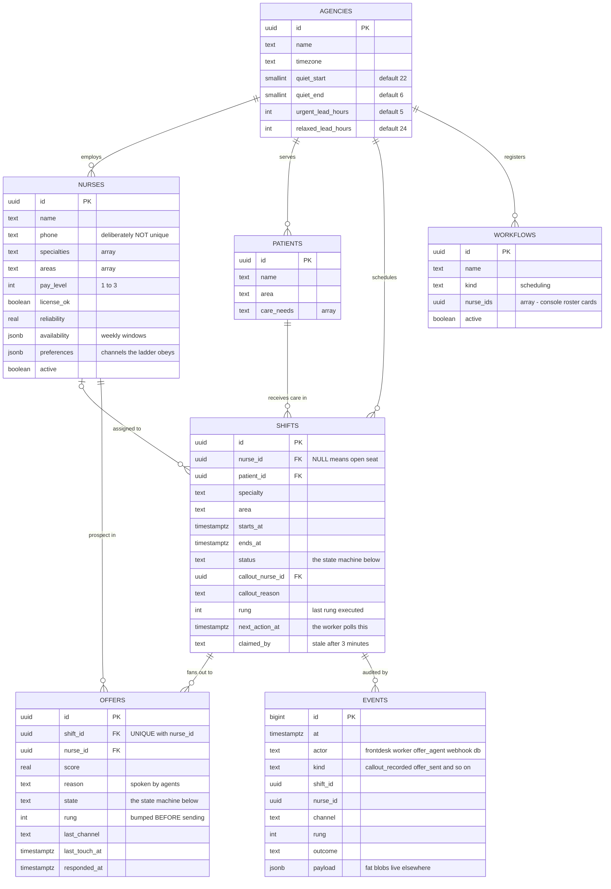
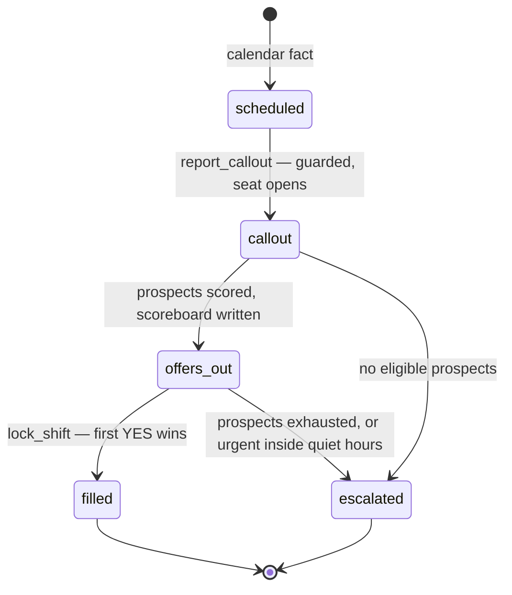
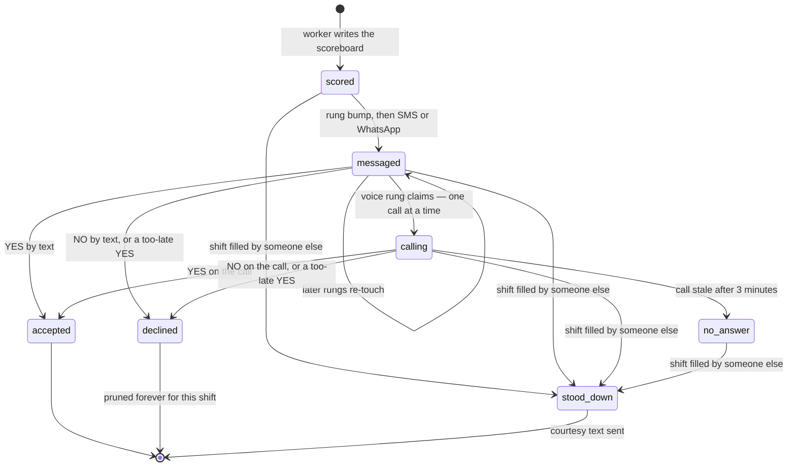

# Architecture

Component-by-component walkthrough of Rock Scheduler. For the one-page overview and the deployment topologies, start at the [README](../README.md). Companions: [decisions](decisions.md) explains *why* things are shaped this way, [deployment](deployment.md) explains where each piece runs, [demo](demo.md) walks a live run.

The system is organized around one rule: **tools are the only crossing between the conversation plane and the work plane.** The voice side never imports the database; the work side never knows which voice engine is speaking. Everything coordinates through Postgres rows, which is also why the ops console can be a pure window.

## Package walkthrough

### voice/ — the conversation plane

| File | Role |
| --- | --- |
| `entry.py` | LiveKit worker entrypoint. Registers as `AGENT_NAME` so the SIP dispatch rule routes inbound calls here. Job dispatch metadata picks the agent: `{"role": "offer", "offer_id": ...}` builds an OfferAgent, anything else builds FrontDesk. Also wires transcript and per-turn latency logging — the seam where future passive listeners attach. |
| `session_factory.py` | The engine seam. The only module that knows engine names; maps `ENGINE_PROFILE` to one adapter. Agents and tools never import engines, which is exactly what makes swapping engines a config change instead of a code change. |
| `engines/cascade_default.py` | Deepgram STT, OpenAI LLM, Cartesia TTS, Silero VAD, and the LiveKit Inference turn detector. Each stage uses the vendor plugin when its API key is set, otherwise the same model routes through LiveKit Inference — one LiveKit key can run the whole pipeline. |
| `engines/realtime_openai.py` | OpenAI Realtime speech-to-speech. The model owns VAD and turn detection, so nothing else is configured — adding them would fight the model's built-ins. |
| `engines/gemma_phi.py` | Deliberate stub. Raises `NotImplementedError` with a clear message. Reserved for the fully self-hosted cascade (Ollama-served Gemma plus local STT/TTS) described in [deployment](deployment.md). |
| `agents/front_desk.py` | The inbound agent. Instructions cover spoken style and the callout script; tools are the three scheduling facades. An identity block generated from the caller's phone number tells the agent whether it already knows who is calling (see identity resolution below). |
| `agents/offer_agent.py` | The outbound agent, built per call as a closure over one offer row. Its only tools accept or decline that single offer, both guarded and audited. A prompt-injecting callee has nothing else to reach: no roster tool, no patient tool. |

### workplane/ — the brains behind the tools

| File | Role |
| --- | --- |
| `tools/scheduling_tools.py` | The facade tools FrontDesk carries: `find_nurse`, `get_shift`, `report_callout`. Intent-shaped and engine-agnostic. `report_callout` is the trigger for the whole backfill machine — one guarded row update wakes the worker. |
| `agents/matching_agent.py` | Pydantic AI ranker for conversational answers. Reads the live roster, returns at most three matches with spoken-friendly reasons. Used by `find_nurse` only; the dispatch worker uses the deterministic scorer instead. |
| `agents/sms_agent.py` | Pydantic AI responder for inbound texts. Every reply is grounded in a trusted context block built from what the database knows about the sender's phone: which nurses it backs, any pending offer (with pay), their next shifts, and the recent SMS back-and-forth. Untrusted message text travels only in the user turn, never in instructions. |
| `offers.py` | `accept_offer` and `decline_offer` — the one implementation used by the voice tools, the SMS webhook, and any future button. A winning accept calls `lock_shift`, then stands down every still-open prospect (guarded state change plus a courtesy text) as a background task so live calls stay snappy. A too-late YES is recorded as declined with outcome `yes_too_late`. |

### workers/ — the dispatch loop

| File | Role |
| --- | --- |
| `dispatch_worker.py` | One process, many short bursts: claim due shifts (SKIP LOCKED inside Postgres), do seconds of work, write the checkpoint, release. `callout` shifts get scored and a scoreboard written; `offers_out` shifts advance one ladder rung. Polls every `WORKER_POLL_SECONDS` (default 2). One bad shift never kills the loop. |
| `scoring.py` | Deterministic prospect ranking. Hard filters first: excluded ids (already booked in the window, plus the callout nurse), inactive, license not ok, specialty mismatch. Then a weighted sum — specialty 0.30, area 0.25, availability 0.20, reliability 0.15, cost 0.10 — returning the top 4. No LLM cost per callout, and every score is explainable. |
| `ladder.py` | Pure policy, no I/O. Lead time picks the plan: RELAXED at 24h or more (SMS, re-SMS, WhatsApp, then voice), NORMAL in between, URGENT at 5h or less (SMS plus WhatsApp immediately, voice 10 minutes later). The plan is re-picked from the *current* lead time on every rung, so a shift drifting closer automatically escalates. Quiet hours: calls allowed between 06:00 and 22:00 agency-local. |
| `rungs.py` | Rung execution. Message rungs bump each offer's rung *before* sending (crash-resume never double-contacts) and honor each nurse's channel preferences. The voice rung calls one prospect at a time, marks stale calls (3 minutes) as `no_answer`, and escalates when prospects are exhausted or an urgent shift sits inside quiet hours. Fake 555 numbers are skipped, never dialed. |

### channels/ — transport only

| File | Role |
| --- | --- |
| `telephony.py` | LiveKit SIP plumbing. `status` prints trunks, dispatch rules, and config mismatches; `provision` creates the inbound trunk, dispatch rule, and outbound trunk for a fresh number and refuses to touch numbers claimed by other trunks. |
| `outbound.py` | Places calls: dispatch the agent into the room first, then dial via the SIP outbound trunk, so the callee never answers into an empty room. Metadata on the dispatch decides which agent gets built. |
| `sms.py` | Senders with one shape — every function returns an ok/error dict and never raises, because messaging must not take down a live call. `send_sms` routes exclusively through TextBelt (Twilio US SMS is A2P-blocked); WhatsApp rides Twilio's Messages API. Outbound TextBelt sends carry a `replyWebhookUrl` when `PUBLIC_BASE_URL` is set. |
| `webhook.py` | The inbound message server on `:8787`. Routes: `/textbelt-reply` (HMAC-validated), `/sms` (Twilio-signature-validated), `/health`. A strict YES/NO parser handles pending offers first; everything else goes to the work plane's SMS agent with a 12-second budget and a safe fallback reply. |
| `cli.py` | Terminal remote control: `status`, `call`, `sms`, `whatsapp`, `textbelt`, `serve`, `link-sms`, `provision`. |

### data/ — the source of truth

| File | Role |
| --- | --- |
| `schema.sql` | The five domain tables plus `agencies`, the two SQL functions (`claim_shifts`, `lock_shift`), the status-change audit trigger, and RLS. Heavily commented — read it. |
| `dashboard.sql` | Console additions: the `workflows` table, nurse channel preferences and avatars, anon read policies, the realtime publication, and two anon-callable RPCs — `ff_shifts` (skip ladder waits) and `sync_demo_shifts` (keep demo shifts coherent with profile edits). |
| `db.py` | The only module that talks to Postgres. Enforces the two discipline rules: transitions are always guarded, rungs bump before sends. supabase-py is sync, so every call runs in a thread. |
| `seed.py` | Idempotent demo world: the agency, 10 nurses on fake 555 numbers, 2 patients, 2 demo shifts (one relaxed, one urgent). `--me +1XXXXXXXXXX` puts your real phone on James Okafor. |

### shared/ — small and boring on purpose

| File | Role |
| --- | --- |
| `config.py` | The single place that reads env vars. Lookup order: shell env, this project's `.env`, then two sibling `.env` files as a fallback for the OpenAI key only. Prints an honest startup summary of what will run. |
| `phone.py` | `is_fake` — the one guard shared by every outbound touch point so 555 and malformed numbers never reach a provider. |
| `spoken.py` | Human phrasing for shift times ("Tuesday 8am to 4pm"), shared by voice and SMS so both channels say times identically. |

### ops-console/ — the window

A React SPA (Vite, TanStack Router, Tailwind, clay design) that talks **only to Supabase** with the anon key. It holds no engine state and calls no engine API.

| Piece | Role |
| --- | --- |
| `src/hooks/use-live-data.ts` | One hook owns all data: initial fetch plus Supabase Realtime merges on `events`, `shifts`, `offers`, `nurses`, `workflows`. The graph, log, and rail all re-render from this state. |
| `src/lib/ops-story.ts` | The graph model. A story is drawn as callout puck, outreach router, prospect pucks, and one pip per outreach attempt, growing rightwards. `frame()` derives coordinates deterministically, so streaming updates never reflow. |
| `src/lib/live-story.ts` | Pure adapters from live rows to that graph, in two user-switchable modes: `normal` (one puck per prospect) and `detailed` (every attempt is its own pip). Also formats the event feed. |
| `src/lib/workflow-store.ts` | The left rail's persistence: registers workflows, upserts nurse profiles (duplicate phones allowed on purpose), and seeds demo shifts so a phone callout can run end-to-end. |
| `src/components/ops/` | `StoryGraph`, `ClayNode`, `ClayStagePip`, `EventLog` (story / live / all filters), `WorkflowRail`, hover cards. |
| `src/routes/index.tsx` | The single page: header (live/paused, fast-forward via the `ff_shifts` RPC), story canvas, event log, workflow rail. |

## Data model

Two constraints do the heavy lifting: the `no_double_booking` exclusion constraint on `shifts` (a nurse can never hold two overlapping shifts — enforced by storage, not code) and `UNIQUE(shift_id, nurse_id)` on `offers` (retries can never double-offer). The index budget is six indexes, led by a partial index on `next_action_at` for the worker's poll.

## Shift lifecycle

`cancelled` and `completed` also exist as reserved statuses in the schema; no code path writes them today. The status-change trigger writes an event row and fires `pg_notify` on every transition, which is what makes the console's live feed free.

## Offer lifecycle

Every arrow above is a guarded UPDATE: the write carries the expected previous state in its WHERE clause, so two racing writers cannot both win. `accept_offer` runs `lock_shift` first; if the lock loses (someone else filled the shift, or the nurse's own calendar overlaps), the YES is recorded as `declined` and answered with a graceful "just filled" message.

## Identity resolution

Inbound calls arrive with the SIP caller number. `entry.py` looks it up in the roster and hands FrontDesk one of four identity postures: unknown phone (ask for a name), exactly one match (greet by name, never ask), several matches (ask which of *those* names is calling — one real phone may back several nurses, deliberately, for solo demos), or not on the roster (ask for a name). The SMS agent does the same lookup per text. Conversation identity is always by name; offers always carry their own `nurse_id`, so shared phones never confuse the state machine.

## Event vocabulary

Everything observable lands in `events`, append-only: `callout_recorded`, `shift_status_changed` (from the trigger), `prospects_scored`, `offer_sent`, `offer_call`, `offer_response` (outcomes `yes`, `yes_too_late`, `no`), `stand_down`, `escalated`, `sms_in`, `sms_out`. Fat payloads like transcripts belong in object storage; events carry URLs and small JSON only. The console's event log is just this table, filtered three ways: this story, live, all.
