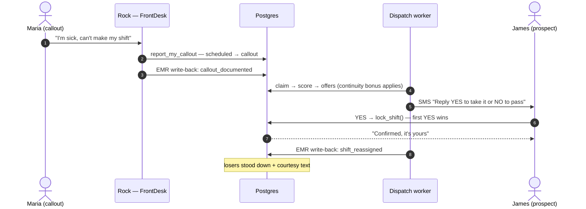
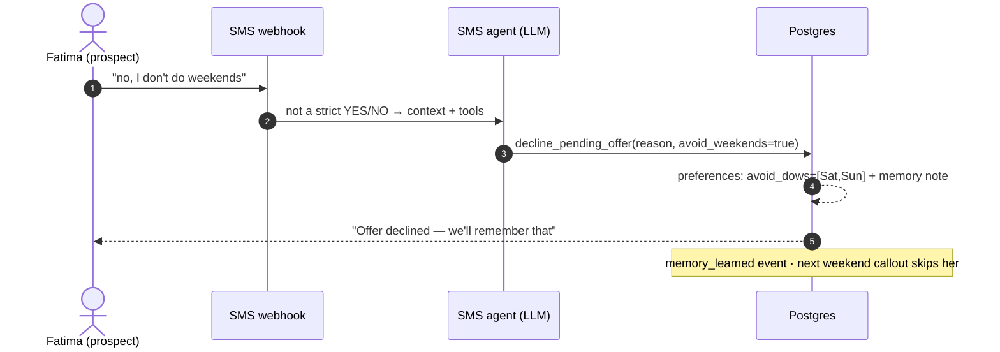
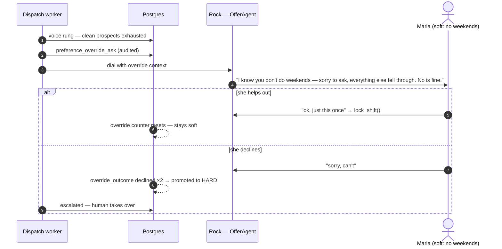
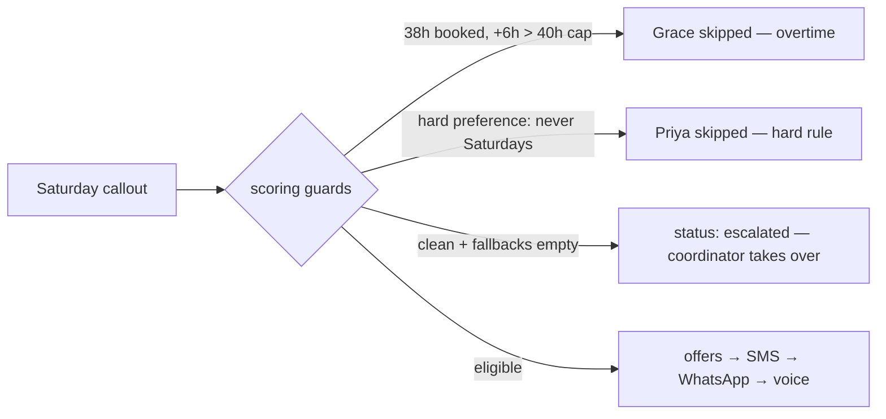

# Use cases — the four stories the engine tells

Each case below is a real path through the code, with the exact audit events to watch in the console's live feed. They compose: one messy afternoon can walk through all four.

## 1. The golden path — first YES wins

Maria calls out sick; the worker scores replacements, texts them, and the first YES locks the shift atomically. Everyone else is stood down politely.

**Events:** `callout_recorded` → `emr_writeback` → `prospects_scored` → `offer_sent` → `offer_response yes` → `shift_status_changed offers_out→filled` → `emr_writeback` → `stand_down`.

## 2. Decline with a reason — memory is born

Fatima replies *"no, I don't do weekends"*. Not a bare NO, so the SMS agent interprets it once, declines the offer, and compiles the sentence into a rule.

**Events:** `sms_in` → `offer_response no` → `memory_learned` → (next weekend) `prospects_scored` with *"held back — learned preference"*.

## 3. The last-resort override — asking like a human

A Saturday callout where every clean prospect is exhausted. Instead of escalating, Rock makes one gentle call to a soft-preference nurse — opening with the apology, never pushing.

**Events:** `preference_override_ask` → `offer_call` → `override_outcome` → (`shift_filled` | `escalated`). Two declines auto-promote to `hard_avoid_dows` — she is never asked again. Details in [memory](memory.md).

## 4. The guards — overtime, hard preferences, escalation

The scorer refuses quietly dangerous fills and says why, out loud, in the audit feed.

**Events:** `prospects_scored` carries every skip note (`skipped`, `fallbacks` payload keys); a dead-end ends as `shift_status_changed → escalated` — an audited stop, never a silent one.

---

Run any of these yourself with the one-phone playbook in [demo.md](demo.md); the hero GIF at the top of the README is case 1 + 2 + 3 played by the console's built-in demo mode (regenerate it with `ops-console/scripts/demo-gif/`).
