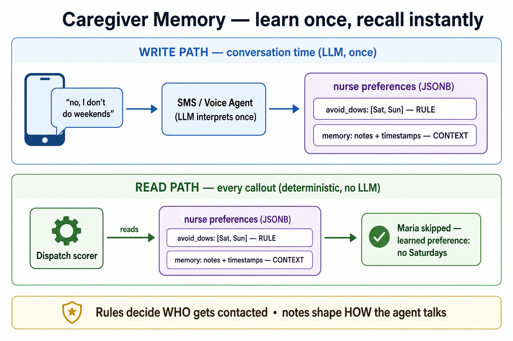
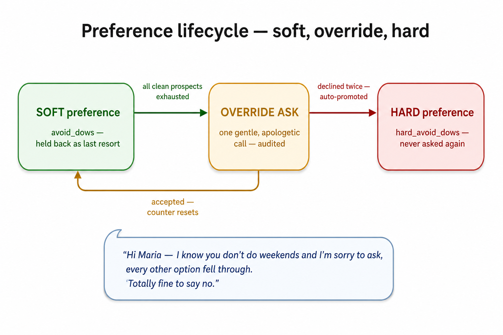

# Caregiver memory

Rock learns what nurses tell it — once — and then recalls it for free on every callout. The design rule: **an LLM interprets language at write time; scoring reads plain data at read time.** No model call ever sits inside the 2-second dispatch loop.

## Write path (conversation time)

A nurse texts *"no, I don't do weekends"* — not a bare NO, so the strict YES/NO parser passes it to the SMS agent, whose scoped `decline_pending_offer(reason, avoid_weekends)` tool:

1. declines the offer through the same `decline_offer()` every channel uses,
2. stores the reason in `nurses.preferences` — a capped `memory` list of notes plus compiled `avoid_dows` rules (Python weekdays, Mon=0..Sun=6),
3. logs a `memory_learned` audit event.

Voice declines learn the same way: the OfferAgent's `decline_this_shift(reason, avoid_weekends)` feeds the identical `learn_nurse_preference()` path.

## Read path (every callout)

`workers/scoring.py` already holds the nurse rows, so recall is a set-membership check — microseconds, deterministic, explainable:

- `hard_avoid_dows` → never ranked, never contacted: *"Grace skipped — hard preference: never Saturdays"*
- `avoid_dows` (soft) → held out of the clean ranking but kept as a **last-resort fallback**: *"Maria held back — learned preference: no Saturdays (last resort only)"*

Every skip lands in the `prospects_scored` event, so the console shows the reasoning live.

## The override ladder (soft preferences only)

When every clean prospect is exhausted, the voice rung makes **one** gentle, apologetic call to a fallback nurse — never the SMS/WhatsApp barrage. The call is audited as `preference_override_ask`, and the outcome updates the memory itself:

- **Accepted** → `override_declines` resets; the preference stays soft.
- **Declined twice** → `avoid_dows` auto-promotes into `hard_avoid_dows`; she is never asked again (`override_outcome` events carry the counter).

## Context, not just rules

Notes that don't compile to a rule still matter: the latest memory note is injected into the OfferAgent prompt (*"For context, they previously mentioned: …"*) and the SMS agent's trusted context block — so the conversation is considerate even when scoring can't act on the note.

## Where a richer memory plugs in later

`learn_nurse_preference()` and the context builders are the seam. A reasoning memory service (e.g. self-hostable [Honcho](https://github.com/plastic-labs/honcho)) can consume every transcript in the background and periodically compile richer conclusions back into the same `avoid_dows`-style rules — the hot path stays exactly this dumb and fast.
