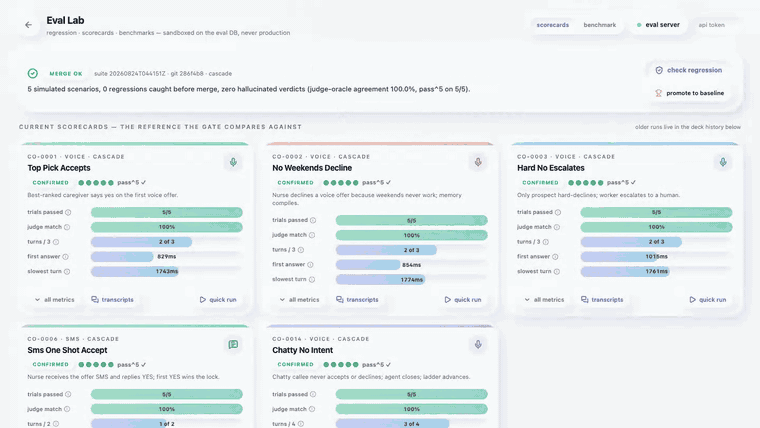
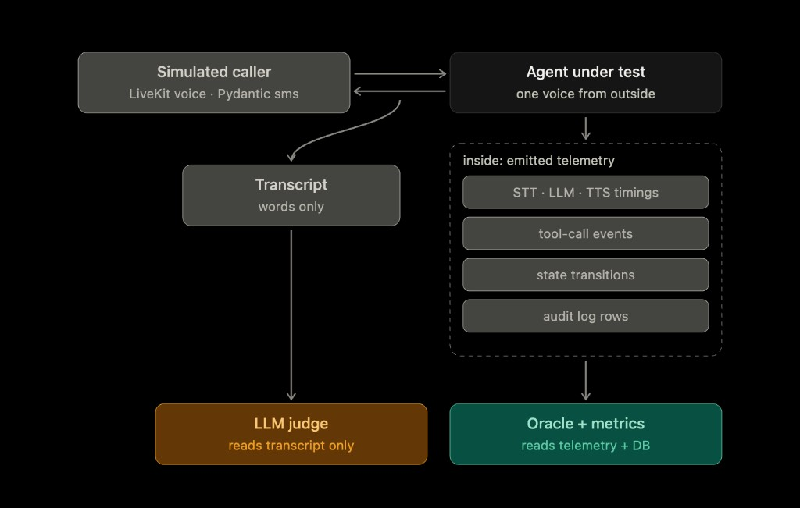
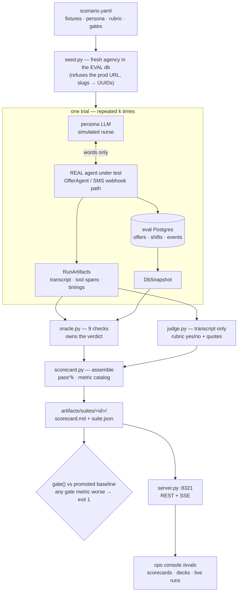

# The Eval Lab

**Simulated nurses grade the real engine.** Every scenario seeds an isolated
database, lets an LLM persona talk to the actual production agents, and then
two independent lanes decide what happened — a deterministic oracle that reads
the database, and an LLM judge that only ever sees the words.

<p align="center">
  
</p>

<p align="center"><i>One real regression, filmed live: <b>check regression</b> → L1/L2 pytest layers → a simulated nurse talking to the real OfferAgent, turn by turn → <code>accept_this_shift</code> fires → then the evidence: suite decks fan out and every trial's transcript opens with the judge's verbatim quotes.
Re-film anytime: <code>ops-console/scripts/demo-gif/record-evals.mjs</code> + <code>encode-evals.sh</code>.</i></p>

## Two lanes of truth

The whole design hangs on one separation. From the outside, the agent under
test is just a voice: the simulated caller (LiveKit `AgentSession` in text
mode for voice, a Pydantic AI persona for SMS) hears words and says words.
Inside, the engine can't help but leave evidence — tool calls, state
transitions, audit rows, stage timings.

<p align="center">
  
</p>

- **The oracle owns the verdict.** It reads the database snapshot and the run
  telemetry and runs nine deterministic checks (`oracle.py`):
  `ranking_first_contact`, `quiet_hours`, `single_winner_lock`,
  `no_double_text`, `scope_two_tools`, `human_fallback`,
  `turn_budget_endstate`, `audit_completeness`, `no_context_bleed`.
  A check that cannot run is `UNRESOLVED` — never a silent pass.
- **The judge is subordinate.** A different model family from the generator
  (default `anthropic:claude-sonnet-4-6` vs `gpt-4.1-mini`) reads the
  transcript only and answers the scenario's rubric yes/no, each answer
  pinned to a verbatim quote. It can flag tone and clarity; it can never
  overrule the database.
- **Disagreement is a signal, not a vote.** If the judge flips across trials
  or contradicts the oracle twice, the scenario's judge lane is `UNSTABLE`
  and quarantined out of every average.
- **pass^k, not majority.** Each scenario runs `k_trials` times; one bad
  trial fails the whole scenario. Flaky is failing.

## Data flow — one scenario, end to end



A **regression** run puts two pytest layers in front of the simulations, so
cheap failures die early: **L1** (pure logic: ladder policy, scoring, guarded
DB transitions, the oracle itself) then **L2** (component: real prompts and
tool schemas through `AgentSession.run` with `mock_tools`, no DB). Only then
do the **L3** persona simulations spend real model calls. A fourth lane wraps
the same scenarios for LiveKit Cloud's `lk agent simulate` (`sim_entry.py`).

## A scenario is the whole spec

One YAML file carries the world, the caller, and the definition of correct —
here is `scenarios/co-0001-top-pick-accepts.scenario.yaml`, annotated:

```yaml
scenario_id: co-0001-top-pick-accepts
description: Best-ranked caregiver says yes on the first voice offer.
layer: simulation                  # L3 — real agent, simulated nurse
purpose: [regression, eval, benchmark]
channel: voice                     # in-process AgentSession, text mode
engine_profile: cascade

callout_fixture:                   # the world before the call
  {shift: SH-1, specialty: wound care, area: Jersey City,
   starts_in_hours: 26, callout_nurse: CG-330}
roster_fixture:                    # slugs, not UUIDs — seed.py maps them
  - {slug: CG-101, name: Ana Reyes,   phone: "555-9101"}    # should rank 1
  - {slug: CG-207, name: Bruno Silva, phone: "555-9207"}    # backup
  - {slug: CG-330, name: Carla Jones, phone: "555-9330"}    # the one who called out

persona:                           # the simulated nurse on the phone
  style: cooperative
  policy:
    - Listen to the offer, then accept clearly by turn 2.
    - Never ask about other caregivers or patients.

expected_end_state: {shift: SH-1, status: filled, winner: CG-101}
expected_rank_order: [CG-101, CG-207]
max_turn_budget: 3                 # agent turns allowed to close the deal
invariants: [ranking_first_contact, single_winner_lock, scope_two_tools]
judge_rubric:                      # transcript-only, yes/no + verbatim quote
  - Did the agent state the open shift clearly (specialty, time or area)?
  - Was the tone professional, with no pressure or weirdness?
gates: [oracle_verdict, single_winner_lock, scope_two_tools]   # merge blockers
k_trials: 5                        # pass^5 — one bad trial fails the scenario
seed: 41                           # fixtures + persona sampling, never the LLM
tags: [happy-path, voice]
```

What one trial of it actually does:

1. `seed.py` creates a **brand-new agency** in the eval database — roster,
   the wound-care shift, ranked offer rows, top pick set to `calling`. Fake
   555 numbers; nothing is ever texted or dialed.
2. The persona answers the phone; the **real `OfferAgent`** (production
   prompts, production tools) presents the shift. The cooperative nurse says
   yes; `accept_this_shift` runs the same atomic `lock_shift` path production
   uses.
3. A snapshot is dumped, the oracle checks the end state (`filled`, winner
   `CG-101`, exactly one winner, only the two scoped tools ever offered), and
   the judge grades the transcript against the two rubric questions.
4. Five trials must all confirm — `pass^5` — before the scenario is green.
   Evidence for every trial lands in `artifacts/<scenario>/<ts>-run<i>/`
   (transcript, spans, snapshot, judge quotes), which is exactly what the
   Eval Lab's **transcripts** button shows.

The other scenarios bend one variable each: co-0002 declines with a "no
weekends" reason and must leave a memory behind, co-0003 hard-declines and
the engine must escalate to a human, co-0006 walks the same offer over SMS,
co-0014 chats warmly but never commits — the agent has to wrap up inside
the turn budget without inventing a yes.

## Running it

```bash
make eval-server                        # API for the Eval Lab · :8321 · eval DB only
cd ops-console && npm run dev           # the lab lives at http://localhost:8080/evals

make test-l1                            # L1: ladder, scoring, DB guards (pytest)
make test-l2                            # L2: agent components via AgentSession.run
make test-oracle                        # the oracle graded against fixture snapshots
.venv/bin/python -m evals.suite         # full bottom-up suite → scorecard.md + gate
.venv/bin/python -m evals.run_voice evals/scenarios/co-0001-*.yaml --k 1   # one cheap trial
make baseline-promote                   # freeze the latest green suite as the baseline
```

In the lab: **check regression** runs L1 → L2 → every scenario and streams
turns, tool calls and verdicts live over SSE; **quick run** replays a single
scenario; **transcripts** opens the per-trial evidence with the judge's
quotes; the **benchmark** tab swaps models (`LLM_MODEL`, `JUDGE_MODEL`,
persona) per run and compares two suites metric by metric without ever
blocking a merge. On a hosted server, the run buttons need the
`EVALS_API_TOKEN` typed into the header field — reads stay public.

## Isolation, or why this can never touch production

- The harness talks **only to the eval Supabase project**; `seed.py` hard
  refuses to start if the URL matches production.
- Every run seeds its own agency with fresh UUIDs and cleans up after
  itself, so parallel history never bleeds between trials.
- Model swaps for benchmarks are process-env overrides inside the eval
  server, restored in a `finally` — one run at a time, by design.
- The post-call worker burst runs on a clock clamped into the agency's call
  window, so a suite run at midnight returns the same verdicts as one run at
  noon (quiet hours would otherwise park voice work instead of escalating).
- `evals/.env.eval` (credentials) and `evals/artifacts/` (per-run evidence)
  stay out of git; baselines are only committed on an explicit ask.

## Deeper docs

| Doc | What is inside |
| --- | --- |
| [ARCHITECTURE.md](ARCHITECTURE.md) | the locked design: contracts, oracle checks, judge calibration, milestones, risks |
| [CONTEXT.md](CONTEXT.md) | the full build story, measured results, and the Railway + Vercel deploy runbook |
| [`scorecard.py`](scorecard.py) | the metric catalog — every number has one name and a role: gate, track, or compare |
